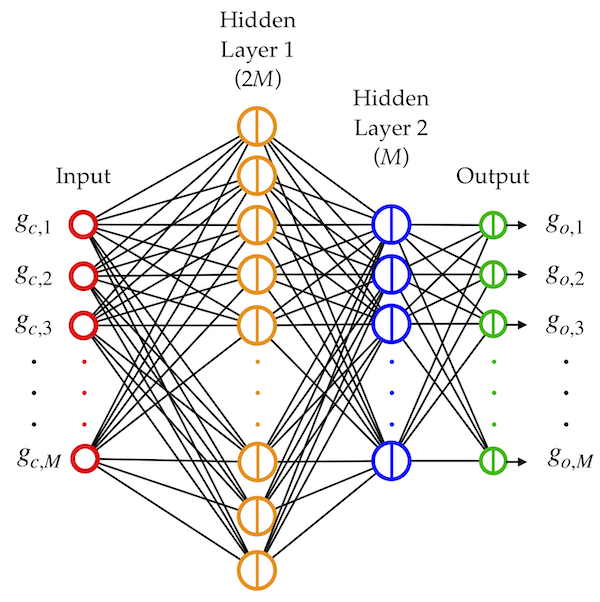

# Third-Octave and Bark Graphic-Equalizer Design with Symmetric Band Filters
This repository has the Matlab scripts needed to run the third-octave and Bark graphic equalizers introduced in our Applied Sciences paper by Jussi Rämö, Juho Liski, and Vesa Välimäki.

The paper is open access and it is available [here](https://www.mdpi.com/2076-3417/10/4/1222).

## Overview of the Paper
This work proposes graphic equalizer designs with third-octave and Bark frequency divisions using symmetric band filters with a prescribed Nyquist gain to reduce approximation errors. Both designs utilize an iterative weighted least-squares method to optimize the filter gains, accounting for the interaction between the different band filters, to ensure excellent accuracy.

This work also applies a recently proposed neural gain control in which the filter gains are predicted with a multilayer perceptron having two hidden layers, see the figure below. Computing the filter gains is about 100 times faster with the neural network than with the original least-squares optimization method.  

## Instructions to run the Matlab Scripts
To run an example design of all four graphic equalizers, run `third_octave_and_bark_symmetric_GEQs.m`.

